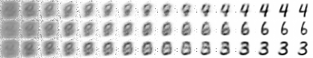
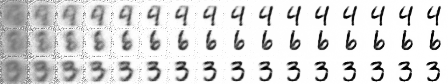

# Generative Latent Attentive Sampler

## Abstract

Attention mechanisms have been used in a wide variety of settings from *Neural
Turing Machines* (NTM) to the *Deep Recurrent Attentive Writer* (DRAW). In this
paper, the use of attention is focused on extracting a single feature (or a
small set of features) from the latent space of a deep generative model (DGM).
The extracted feature(s) are used to draw samples from a portion of the latent
space allowing for iterative construction of images.


## Introduction

Hierarchical categorization (i.e., the process of categorizing objects using
hierarchies) is a ubiquitous approach utilized by humans to make sense of the
world. For example, if asked to visualize a particular object, one might bring
to mind a chair. If asked further what type of chair it is, "an arm chair" or
"a desk chair" might be the response. As more features of the chair are pointed
out, a clearer more refined visualization of the chair would become apparent.
The *Deep Recurrent Attentive Writer* (DRAW; Gregor et al., 2015) showed that,
through the use of visual attention, an iterative modification of a canvas
could produce a state of the art reconstruction. A follow-up (Gregor et al.,
2016) showed that the approach can be extended for a hierarchical
conceptualization of the input image. Rather than making use of attention over
the pixels of an image, the approach in this paper shifts attention to features
of the latent space. The goal is to iteratively refine the output by focusing
on one part of the latent space at a time, allowing refinement at the feature
level.

Taking inspiration from the DRAW network, the basis of Generative Latent
Attentive Sampler (GLAS) is a recurrent encoder model, which feeds into a
latent attention mechanism that produces a sample from which a decoder
generates the output. The loss is similarly a variational bound on the
log-likelihood of the data and thus makes the model a type of *variational
auto-encoder* (Kingma & Welling, 2014). One of the key differences from the
DRAW model is that the latent space is made up of a read-only memory, from
which a single feature (or a small set of features) is read through the use of
an attention mechanism. The attention mechanism is then used to generate
samples from the 𝘱-model.


## Background

The use of an attention mechanism in neural networks has a long history. More
recently, it has been used to select portions of memory in Neural Turing
Machine (NTM; Graves et al., 2014), in Memory Networks (Weston et al., 2014), in
Pointer Networks (Vinyals et al., 2015), for visual attention in DRAW (Gregor et
al., 2015), for Show Attend and Tell (Xu et al., 2015), and in generating images
from captions (Mansimov et al., 2015). The forms of attention employed in these
models are differentiable and trainable with stochastic gradient descent.

DC-IGN (Kulkarni et al., 2015) and InfoGAN (Chen et al., 2016) describe
techniques of disentangling the latent codes for variational auto-encoders
(VAE) and for generative adversarial networks (GAN), respectively. The approach
in DC-IGN is a supervised approach that requires fixing part of the code during
training, when modeling *intinsic* vs *extrinsic* information. On the other
hand, InfoGAN makes use of a lower bound on mutual information to force a code
to closely match a given distribution (e.g., a categorical distribution *Cat*
(𝘒=10, 𝑝=0.1) for the MNIST dataset) to accomplish the task without
supervision. The use of a hierarchical model similar to DRAW has also been used
for separating the latent space, demonstrating a conceptual distinction between
levels of the model (Gregor et al., 2016).

Use of attentional memory with variational auto-encoders has been attempted
before (Li et al., 2016). The goal of the authors' approach was to capture
features at different abstraction layers in an unsupervised manner. The
features would be stored in a read-only memory, which is updated through
optimization rather than written to explicitly. The approach they discuss for
their model shares many key components with the one described in this paper.
Namely, a hierarchical read only memory is used as the latent space for the
deep generative model. Finally, Li and colleagues (2016) mention the goal of
trying their approach with a DRAW-like model in the future.


## Method

A new technique was developed, in order to best optimize the model for
attention over the latent space. The technique relates to the use of attention
mechanisms. Several attention mechanisms have previously been explored. The
DRAW network uses 2D Gaussian filters; NTM uses cosine similarity combined with
softmax; Li and colleagues (2016) used sigmoid and alternatively softmax based
attention. In order to apply attention to the latent space of the model, all of
the aforementioned approaches were tried. However, these methods resulted in a
poor optimization of the cost function. Accordingly, a method was devised which
achieved better results and is elaborated upon below.

### Latent Attention

What follows is an outline of the GLAS model with its use of an attention
function. The model relies on the approach of Gregor and colleagues (2015). Let
𝒙 denote the input to be reconstructed, and 𝒐𝑡 denote the output of the model
at time step 𝑡. The encoder function 𝑬 produces a vector 𝒆𝑡 at time step 𝑡.
Similarly, 𝑫 is the decoder function which computes the vector 𝒅𝑡 at time step
𝑡.

The encoder output 𝒆𝑡 is passed to the latent attention function 𝑨. The set of
features 𝒂𝑡 extracted by 𝑨 over the latent space 𝕃 are then used to sample from
the approximate posterior 𝒛𝑡 ∼ 𝘘(𝑍𝑡|𝒂𝑡). The sigmoid function is denoted by 𝛔
below:

```
𝒙'𝑡 = 𝒙 - 𝛔(𝒐𝑡₋₁)
𝒆𝑡 = 𝑬([𝒅𝑡₋₁,𝒙,𝒙'𝑡])
𝒂𝑡 = 𝑨(𝒆𝑡, 𝕃)
𝒛𝑡 ∼ 𝘘(𝑍𝑡|𝒂𝑡)
𝒅𝑡 = 𝑫([𝒅𝑡₋₁,𝒛𝑡])
𝒐𝑡 = 𝒐𝑡₋₁ + 𝒅𝑡
```

As previously mentioned, this project tried to make use of many forms of
attention. The most basic was the use of the sigmoid and softmax activation
functions over the latent space. The use of these activation functions did
little to reduce the dimensionality of the problem, as there cannot be a focus
on an explicit portion of the latent space. Treating the latent space as an 𝛮 𝘹
𝛭 memory matrix, which is addressed using a content based addressing mechanism
similar to NTM, was also attempted. Finally, considering the latent space as an
𝛮 𝘹 𝛭 matrix and running a Gaussian filter over it, the approach used by the
DRAW network, was attempted.

While none of these techniques produced desirable results, they did provide
useful insights in order to create a better attention mechanism, the Cauchy
filter.

#### Cauchy Filter

The Gaussian filter used in DRAW is a 2D filter over the image, which extracts
patches of varying size and sharpness. The Cauchy filter is similarly a 2D
filter; however, instead of being applied over the image, the Cauchy filter is
applied over the latent space 𝕃. The filter is based upon the Cauchy
distribution, which is defined as:

```
[𝜋𝛾(1 + ((𝑥-𝑥₀)/𝛾)²)]⁻¹
```

The Cauchy distribution can be interpreted as the ratio of two independent
normally distributed random variables, if 𝑋,𝑌 ∼ 𝒩(0, 1) then 𝑋/𝑌 ∼ *Cauchy*(0,
1). When the filter matrix is multiplied by the latent space **𝒁**, this can be
seen as a linear combination of the form:

```
  (𝑍ᵢ * Xⱼ / Yⱼ) + (𝑍ᵢ₊₁ * 𝑋ⱼ₊₁ / 𝑌ⱼ₊₁) + ...
```

## Experiments

The model was tested on the binarized versions of both the MNIST (LeCun et al.,
1998) and the Omniglot (Lake et al., 2015) dataset. The binarized version of the
MNIST dataset is the same used by Larochelle and colleagues (2011), while the
Omniglot dataset is a 28x28 binarized version from Burda and colleagues (2015).

For optimization, Adam was used (Kingma & Ba, 2015) with 𝛽₁=0.9, 𝛽₂=0.999,
𝜖=10⁻⁸ and minibatch sizes of 128. The size of the latent space 𝕃 was 9x9, with
a 5x5 latent attention filter. At each of the 64 time steps, a sample of size
25 was generated from the approximate posterior, 𝒛𝑡 ∼ 𝘘(𝑍𝑡|𝒂𝑡).

|  Dataset | NLL    |
|:---------|-------:|
| MNIST    | 89.67  |
| OMNIGLOT | 119.63 |


**MNIST**

These are samples generated by the model. Notably, the differing images during
the earlier time steps appear uniform; they slowly transition to adding more
unique features to distinguish the images. In contrast, DRAW generates images
which best describe the total distribution at each time step.

*Samples generated using latent attention over 16 time steps*  


*Samples generated using DRAW over 16 time steps*  


## Unsuccessful Approaches

The above review of the existing literature highlights a lack of information on
unsuccessful approaches attempted by researchers. Knowing what approaches have
been tried can be useful, as such what follows is a breakdown of techniques
tried in this project. Some are still available to try in the source code
repository associated with this project.

1. Progressively build a mask of the latent space, such that the first layer
only selects and uses a portion of the latent space. Each subsequent layer has
that portion of the latent space fixed and must then optimize the remaining
degrees of freedom. This approach could be thought of as similar to the
iterative canvas approach from DRAW. Instead of progressively making the
*canvas* more and more refined by adding to it at each step, make the *latent
space* more and more refined by adding to it at each step. It turns out that
the use of a mask significantly reduces the ability to optimize the model.

2. Make use of a fixed latent space that is initialized once, at the creation of
the model, rather than learned. It seems that, due to the nature of random
initialization of the latent space, it is sometimes not possible to reconstruct
the input, unless a very small filter such as 1x1 or 2x2 is used. (Even then, it
is not always able to reconstruct the input). One potential two-step approach
to try in the future is: first generate the latent space (by a supervised
learning approach, such as classification), then use the fixed latent space.
The supervised step could be done in tandem with optimizing the variational
bound.

3. Use a standard uniform prior 𝑈(0, 1). This was attempted in two ways. The
first optimized the χ² divergence from the uniform prior to the approximate
posterior. The second tried to reduce the dependence on variational inference.
It did so through the use of the probability integral transform, from the
approximate posterior into a uniform distribution. The transform utilized an
estimation of the moments of the approximate posterior.

4. Use the Hellinger distance as a variational bound. While both the Hellinger
distance and the Kullback-Leibler divergence are a class of 𝑓-divergence, they
do not necessarily afford the same bounding properties.

5. An attempt was made to try to make use of the χ² divergence, though after
closer examination of the approach it turns out the method used was not
actually optimizing for the χ² divergence as intended. This was a result of an
oversight of the min χ² divergence distribution's probability density function
and a subsequent mistake in the programming for the approach.

## Conclusion

The GLAS model detailed here puts attention on a small set of latent variables
per time step of a deep recurrent model. The results demonstrate that the model
clearly attends to a small portion of the latent space per time step. This can
be seen in images generated from the model trained on the binarized MNIST
dataset. Additionally, a 2D differentiable attention mechanism, modeled after
the attention used in DRAW, was developed.

## Future Work

A future avenue of research is to minimize the plausibility of the canvas at
each time step. Basically, the idea is to have the likelihood that the canvas
is sampled from the true distribution be as high as possible at each time step.
The goal is to have a hierarchy of representation, such that each time step
represents the addition of a single feature or a set of features.

Additionally, as the model applies attention over the latent space, it should
be well suited to text datasets. A goal is to apply the model to such a
dataset and visualize the output of the model at each time step.

## References

[[1]] Burda, Yuri, Roger Grosse, and Ruslan Salakhutdinov. "Importance weighted autoencoders." arXiv preprint arXiv:1509.00519 (2015).

[[2]] Chen, Xi, et al. "InfoGAN: Interpretable representation learning by information maximizing generative adversarial nets." Advances in Neural Information Processing Systems. 2016.

[[3]] Graves, Alex, Greg Wayne, and Ivo Danihelka. "Neural turing machines." arXiv preprint arXiv:1410.5401 (2014).

[[4]] Gregor, Karol, et al. "DRAW: A recurrent neural network for image generation." arXiv preprint arXiv:1502.04623 (2015).

[[5]] Gregor, Karol, et al. "Towards conceptual compression." Advances In Neural Information Processing Systems. 2016.

[[6]] Kingma, Diederik P., and Max Welling. "Auto-encoding variational bayes." arXiv preprint arXiv:1312.6114 (2013).

[[7]] Kingma, Diederik, and Jimmy Ba. "Adam: A method for stochastic optimization." arXiv preprint arXiv:1412.6980 (2014).

[[8]] Kulkarni, Tejas D., et al. "Deep convolutional inverse graphics network." Advances in Neural Information Processing Systems. 2015.

[[9]] Lake, Brenden M., Ruslan Salakhutdinov, and Joshua B. Tenenbaum. "Human-level concept learning through probabilistic program induction." Science 350.6266 (2015): 1332-1338.

[[10]] Larochelle, Hugo, and Iain Murray. "The Neural Autoregressive Distribution Estimator." AISTATS. Vol. 1. 2011.<Paste>

[[11]] LeCun, Yann, et al. "Gradient-based learning applied to document recognition." Proceedings of the IEEE 86.11 (1998): 2278-2324.

[[12]] Li, Chongxuan, Jun Zhu, and Bo Zhang. "Learning to generate with memory." Proc. ICML. 2016.

[[13]] Mansimov, Elman, et al. "Generating images from captions with attention." arXiv preprint arXiv:1511.02793 (2015).

[[14]] Vinyals, Oriol, Meire Fortunato, and Navdeep Jaitly. "Pointer networks." Advances in Neural Information Processing Systems. 2015.

[[15]] Weston, Jason, Sumit Chopra, and Antoine Bordes. "Memory networks." arXiv preprint arXiv:1410.3916 (2014).

[[16]] Xu, Kelvin, et al. "Show, Attend and Tell: Neural Image Caption Generation with Visual Attention." ICML. Vol. 14. 2015.

[1]: https://arxiv.org/abs/1509.00519
[2]: http://papers.nips.cc/paper/6399-infogan-interpretable-representation-learning-by-information-maximizing-generative-adversarial-nets
[3]: https://arxiv.org/abs/1410.5401
[4]: https://arxiv.org/abs/1502.04623
[5]: https://arxiv.org/abs/1604.08772
[6]: https://arxiv.org/abs/1312.6114
[7]: https://arxiv.org/abs/1412.6980
[8]: http://papers.nips.cc/paper/5851-deep-convolutional-inverse-graphics-network
[9]: http://science.sciencemag.org/content/350/6266/1332
[10]: http://jmlr.csail.mit.edu/proceedings/papers/v15/larochelle11a/larochelle11a.pdf
[11]: http://yann.lecun.com/exdb/publis/pdf/lecun-01a.pdf
[12]: https://arxiv.org/abs/1602.07416
[13]: https://arxiv.org/abs/1511.02793
[14]: https://papers.nips.cc/paper/5866-pointer-networks
[15]: https://arxiv.org/abs/1410.3916
[16]: https://arxiv.org/abs/1502.03044
